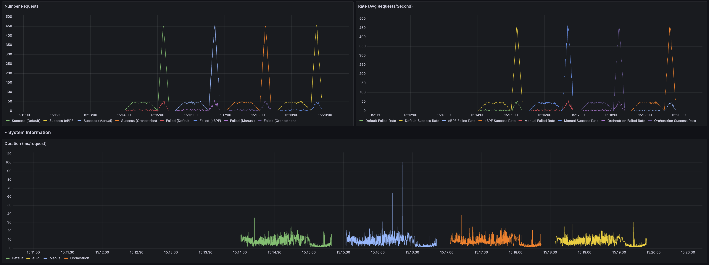
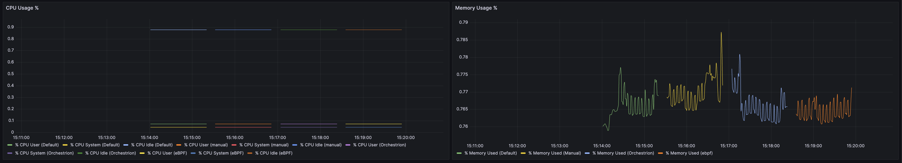

# gopherconus-2025

Presented at GopherconUS 2025. Slides for the presentation are [here](./GopherCon%20US%202025.pdf).

This project is still very much a work in progress, even after GopherCon is over! Upcoming work to:

- [ ] Better incorporate the demo with a Linux VM, such as Lima
- [ ] Enable parallel, continuous runs of the code (currently, all scenarios run in sequence)
- [ ] More metrics! Specifically, we want a whole lot more of Go runtime metrics, like allocations and GC activity. 
- [ ] Integration with DataDog dashboards to visualize traces

## About

This repo tests four different scenarios for running the same web script:

1. No instrumentation
2. Manual instrumentation using [OTel's SDK](https://opentelemetry.io/docs/languages/go/getting-started/)
3. Auto-instrumentation using [Datadog's Orchestrion](https://datadoghq.dev/orchestrion/docs/)
4. Auto-instrumentation using [OTel's Go Automatic Instrumentation](https://github.com/open-telemetry/opentelemetry-go-instrumentation)

For each scenario we run load testing using `k6` to observe the overhead introduced by each approach. The results are graphed using Grafana.

## How to Use

The project includes automated dependency checking and service management through `loadtest.sh`.

### Quick Start

To run load tests with all dependencies checked automatically:

```bash
# Run default scenario (no instrumentation)
./loadtest.sh

# Run specific instrumentation types
./loadtest.sh manual
./loadtest.sh orchestrion
./loadtest.sh ebpf

# Run all scenarios in sequence
./loadtest.sh all
```

Important: eBPF is only available on Linux kernels. If you do not have one by default, check out available VMs like [Lima](https://lima-vm.io/) or [Orb](https://orbstack.dev/).

### Service Management

You can also manage Docker services independently:

```bash
# Start all required services (InfluxDB, Grafana, OTel Collector, etc.)
./loadtest.sh start

# Stop all services
./loadtest.sh stop

# Skip dependency checks if needed
./loadtest.sh start --skip-preflight
./loadtest.sh --skip-preflight default
```

### Available Test Scenarios

1. **"default"** -- runs without instrumentation (baseline)
2. **"manual"** -- runs with manual OpenTelemetry instrumentation
3. **"orchestrion"** -- runs with Datadog's Orchestrion auto-instrumentation
4. **"ebpf"** -- runs with OTel's eBPF auto-instrumentation

### Pre-flight Checks

The script automatically validates dependencies and services via `pre-flight-checks.sh`, which verifies:

- Required commands (docker, docker-compose, go)
- Optional tools (k6, xk6, orchestrion)
- Essential files (docker-compose.yml, main.go, etc.)
- Docker daemon status
- Service health checks

Running any load test will start up Grafana at `localhost:3000` where you can find the 'k6 Load Testing Results' dashboard.




### Viewing Data

By default, metrics and traces will be sent to Datadog. After running `./loadtest.sh`, navigate to your Datadog account and create a dashboard. To quick start, you can import the dashboard JSON available in [datadog_dashboard.json](./datadog_dashboard.json). Remember to set your `DD_API_KEY` in `.env` to ensure traces are sent properly. 

If you are unable to use Datadog, you may instead send metrics and traces to Grafana using InfluxDB by making the following edits:

1. In [otel-collector-config.yaml](./otel-collector-config.yaml), comment out the Datadog exporter
2. In [otel-collector-config.yaml](./otel-collector-config.yaml), set the exporter to `[otlp]` for traces and to `[prometheus]` for metrics.
3. In [loadtest.sh](./loadtest.sh), uncomment out the lines for InfluxDB and comment out the lines for OpenTelemetry.

The Grafana dashboard will be hosted at `localhost:3000`.

## Read More

Interested in (auto) instrumentation? Here are a couple of blog posts and articles that can help you get started!

1. [OTel's Go Automatic Instrumentation](https://github.com/open-telemetry/opentelemetry-go-instrumentation)
2. [Datadog's Orchestrion](https://datadoghq.dev/orchestrion/docs/)
3. [Compile-Time Instrumentation SIG](https://opentelemetry.io/blog/2025/go-compile-time-instrumentation/)
4. [Flight Recording in Go](https://github.com/golang/go/issues/63185)
5. [What is eBPF](https://ebpf.io/what-is-ebpf/)

## Shoutout

Shoutout to [Kemal](https://github.com/kakkoyun) for teaching me all about Orchestrion and eBPF, and for donating his machine to run code on a Linux VM!!