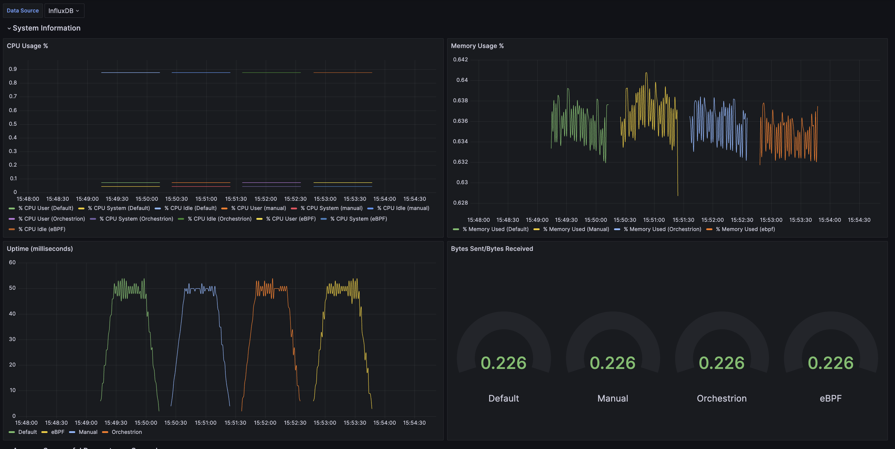
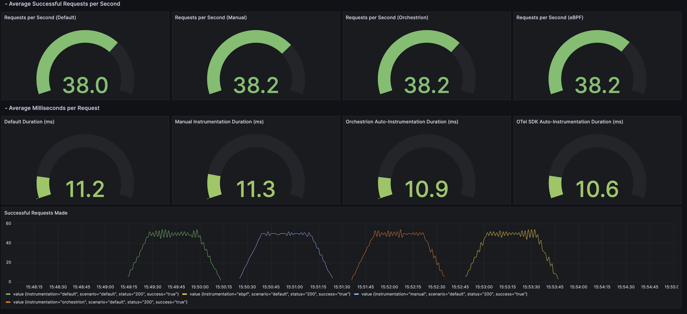

# gopherconus-2025

This repo tests four different scenarios for running the same web script:

1. No instrumentation
2. Manual instrumentation using [OTel's SDK](https://opentelemetry.io/docs/languages/go/getting-started/)
3. Auto-instrumentation using [Datadog's Orchestrion](https://datadoghq.dev/orchestrion/docs/)
4. Auto-instrumentation using [OTel's Go Automatic Instrumentation](https://github.com/open-telemetry/opentelemetry-go-instrumentation)

For each scenario we run load testing using `k6` to observe the overhead introduced by each approach. The results are graphed using Grafana.

## How to Use

To run load tests, use `./run_loadtest.sh`. By default, it will run one scenario (1. No instrumentation). In order to run other scenarios, you can pass in one or more of the following options:

1. "default" -- runs without instrumentation
2. "manual" -- runs with manual instrumentation
3. "orchestrion" -- runs with Orchestrion auto-instrumentation
4. "ebpf" -- runs with OTel's eBPF auto-instrumentation

You can also pass in "all" to run all four scenarios in sequence.

Running `./run_loadtest.sh` will also start up a Grafana instance at `localhost:3000`. Navigate there to find the 'k6 Load Testing Results' dashboard.

